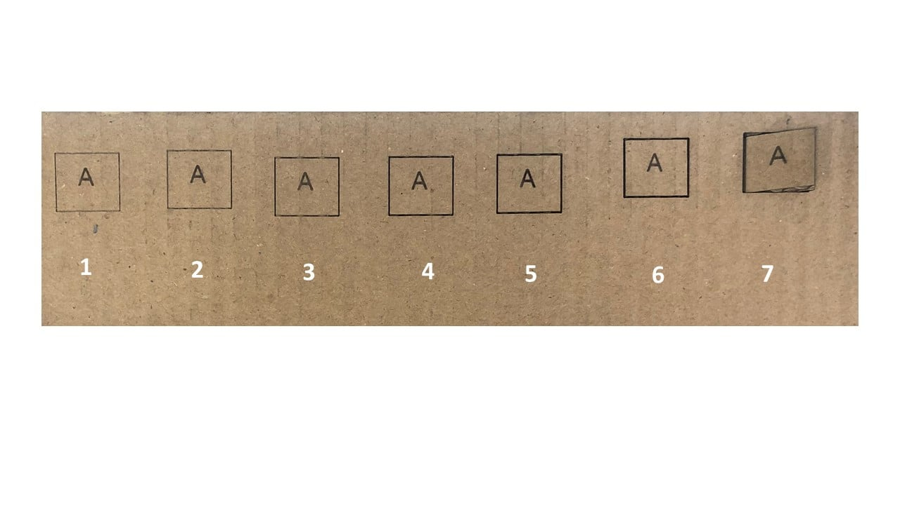
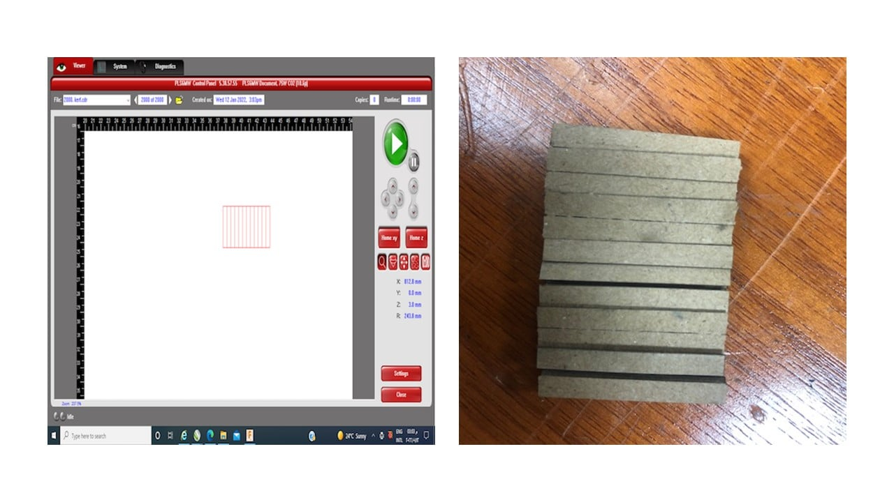

# 4. Group Assignment - Computer controlled cutting
<<<<<<< HEAD
=======

This week goal is to find the kerf and the proper cutting parameters for a specific material.
## **Cardboard (Amal Ashoor)**

For this assignment, I choose the material to be cardboard with 6 mm thickness. Also,  I draw a  square with my initial letter "A" using CorelDraw software. I have tried seven different combinations of speed, power, PPI to get the proper cardboard cutting parameters using the Universal Laser System interface. The letter R in the table is refers to Red color or cutting and B to black color or engraving.

|  Trial  | Power | Speed | Frequency | Observations                                                                                                     |
|---------|-------|-------|-----------|------------------------------------------------------------------------------------------------------------------|
|   1B    |  27%  |  80%  |    500    |Initial guess of the parameters.                                                                                  |
|   1R    |  30%  |  80%  |    500    |Initial guess of the parameters.                                                                                  |
|   2B    |  30%  |  80%  |    500    |Power was increased only.Thus, this result in clear engraving.                                                    |
|   2R    |  45%  |  80%  |    500    |Power was increased only.Thus, this result in a slightly deeper.                                                  |
|   3B    |  30%  |  80%  |    500    |No change.                                                                                                        |
|   3R    |  45%  |  60%  |    500    |Reduce the cutting speed cause a slightly deeper cut.                                                             |
|   4B    |  30%  |  80%  |    500    |No change.                                                                                                        |
|   4R    |  45%  |  30%  |    500    |Reduce the cutting speed to half the figure in the previous trial improved the cutting.                           |
|   5B    |  30%  |  60%  |    500    |Reduce the engraving speed cause the engraving to become unclear.                                                 |
|   5R    |  65%  |  30%  |    500    |Increase the cutting power cause the cutting to enhanced.                                                         |
|   6B    |  30%  |  80%  |    500    |Return the engraving settings to the one in trial four.                                                           |
|   6R    |  100% |  15%  |    500    |Increase the cutting power and reduce the speed cause the laser to penetrate the other face of the cardboard      |
|   7B    |  30%  |  80%  |    500    |No change.                                                                                                        |
|   7R    |  100% |  10%  |    500    |Reduce the cutting speed to 10% cause the design to be easily removed from the cardboard |

Then to calculate the kerf, I draw a rectangle with 6 cm width and 4 cm height using Fusion 360 software. Then, divid the inner part of the rectangle to 12 equal smaller rectangles with 0.5 cm width using the rectangular pattern feature. Then, I laser cut the design on the same cardboard with 0.6 cm thickness using the same proper cutting parameters. After that, I calculated the kerf using the equation:
kerf= (theoretical length- measured length)/(# of sections)
kerf= (6 - 5.8)/(12)= 0.0167 cm= 0.167 mm

## **MDF Wood (Yousif Jalil)**

Here is the Results i got using the Laser Machine, The Material i used is MDF Wood, here are the results i got for laser engraving.

After that i went to try the kerf Adjustment, i did two tries, one with smaller sample and another one with bigger sample

Here the total rectangle length = 60mm
number of rectangles = 12
rectangle length after engraving = 58.22mm
k = (60-58.22)/12 = 0.148mm

similarly here

Here the total rectangle length = 120mm
number of rectangles = 12
rectangle length after engraving = 118.53mm
k = (60-58.22)/12 = 0.1225mm

