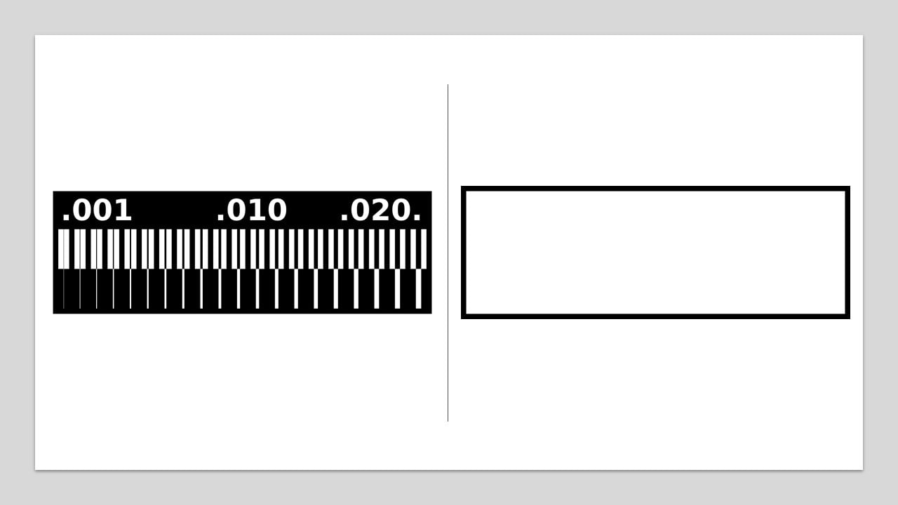
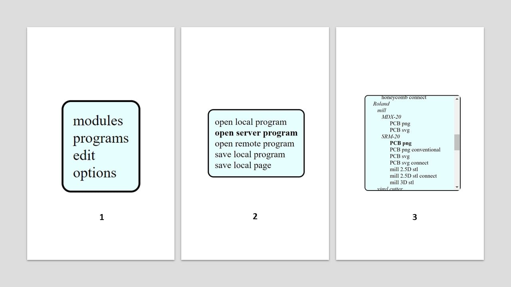
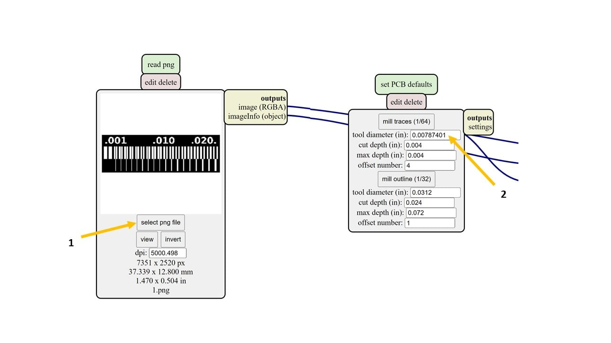
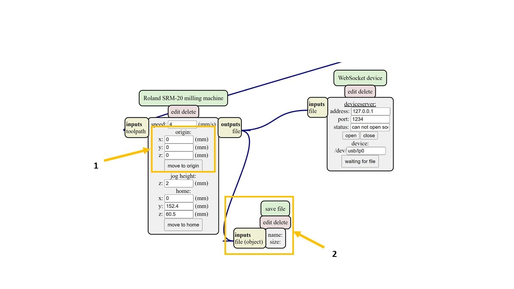
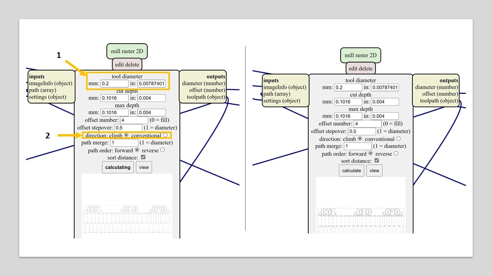
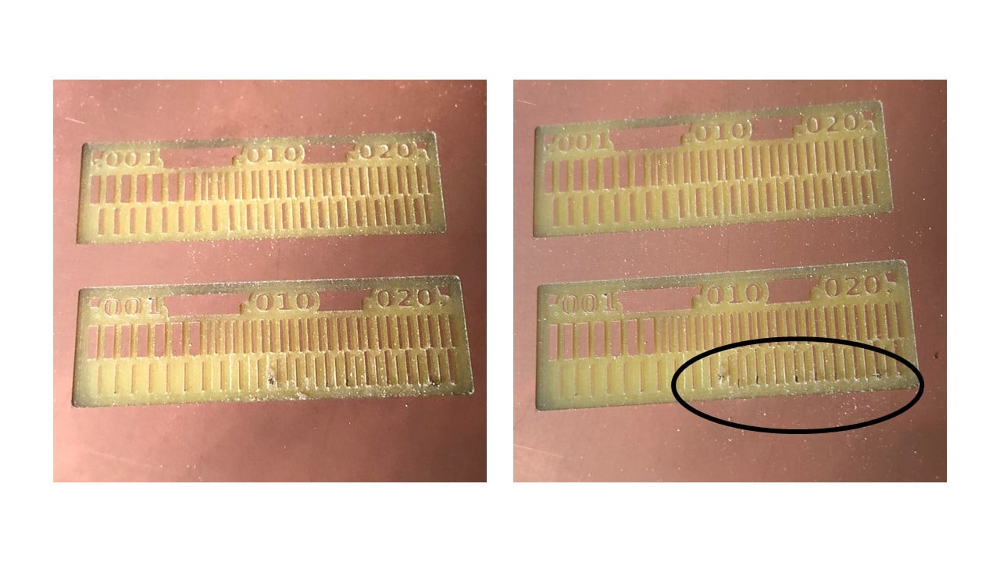

# 5. Electronics production

## 0.2 mm Tool Diameter **Amal Ashoor**

The goal of this week assignment is to describe the design rules using the Roland SRM-20 CNC machine CNC machine. To start the fabrication process, I downloaded the interior and the traces in PNG format from this [website](http://academy.cba.mit.edu/classes/electronics_production/index.html).

To change the PNG images to Ronald mill (.rml), I mainly used this [website](https://mods.cba.mit.edu/). I started by right-click then I selected "Program", "Open server program", and "Roland mill SRM-20 PCB png".

After that, I selected the traces png file and changed the tool diameter to 0.2 mm which equals , which equals 0.00787401 inches.

 I changed the origin of the machine to zero on all axis. To save the output file, I right-clicked on the page and selected "Modules" and "Open server module" and "file save". Then, I connected the input and output as shown below.

Moving to the mill raster 2D, I changed the tool diameter to 0.2 mm and the direction to climb. Then, I pressed on calculate and saved the (.rml) file. I repeated this step in the conventional direction. Then, I changed the png file to the interior and repeated this step in the two directions.

 I changed the milling bit of the machine to 1/64 milling bit and selected the origin point. Then, I cut the climb files first then the conventional files. The results are shown below (top is the climb direction). According to the following image, the climb direction milling is clearer compared to the other one.

<<<<<<< HEAD
=======

>>>>>>> 4255d2635aa16b1cb2a9e0e8819f10f8b977a776
## **Yousef Jalil **

 For the Group assignment we had to test the capabilities of the Machine (Roland SRM-20) to mill extra fine details. also through different milling directions (Climb and Conventional) 
                
 I downloaded the traces provided to test the machines from [Here](http://academy.cba.mit.edu/classes/electronics_production/index.html).
                
 Linetest traces
 
 Outline 
 
 
 
 Then Proceded with Mods to set up the cutting files
 I went to [Mods](https://mods.cba.mit.edu/),Click Right click to pull up the interface then go to Programs 
 
 
 
 Then ---> Open Local Server 
 

 
 
 Choose ---> Roland SRM-20 --> PCB PNG  
 
 
 
 After that you will see a set of nodes 
 
 
 
 what we are going to use is on the left side, click on select PNG and pick the linetest 
 
 
 
 Make sure to change the tool diameter to the one you are going to use in this case 1/64"  
 
 
 
 Make sure to set the machine coordinates x,y,z  to Zero (origin)  
 
 
 
 Then to save your file open the menu by clicking right click again and choose ---> Programs 
 
 
 
 Then --> Open server program
 
 
 
 --> Modules
 
 
 
 Then --> Open server module
 
 
 
 Then --> File --> Save
 
 
 
 And you will get this Node
 
 
 
 And lAST connect the nodes together
 
 
 After checking everything is ok click we will do the the calculation twice, one for the Climb direction and one for the Conventional direction.
 
 
 
 <h3> Results </h3>
 
 <h4>          Climb  </h4>
 
 
 
 <h4>          Conventional  </h4>
 
 

                
    
