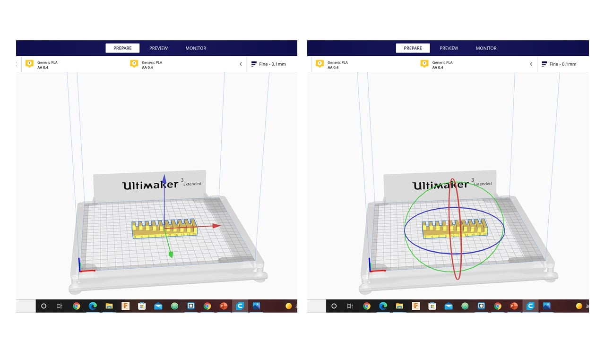
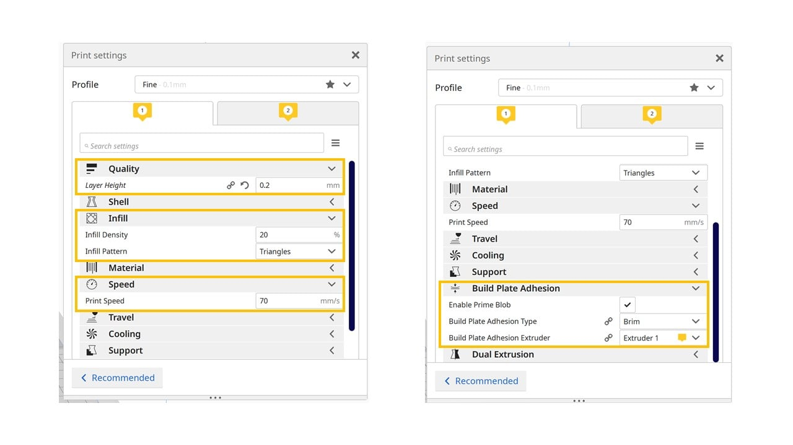
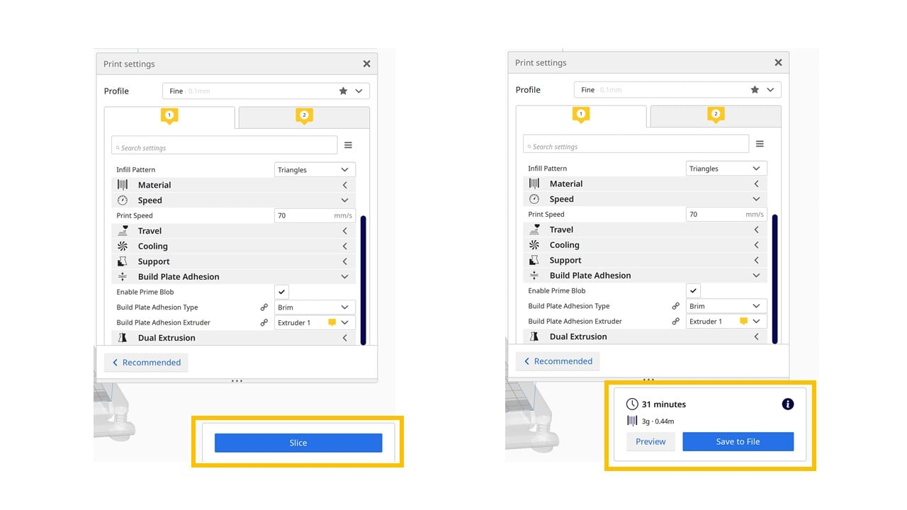
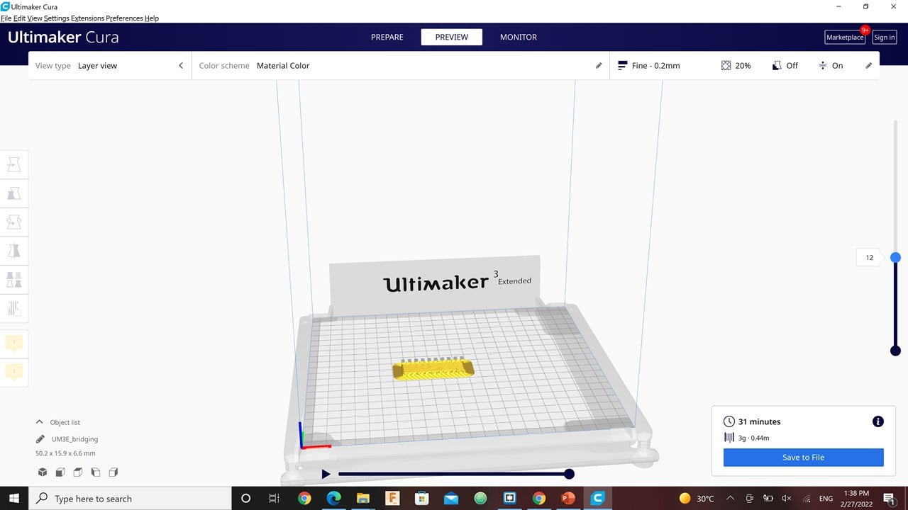
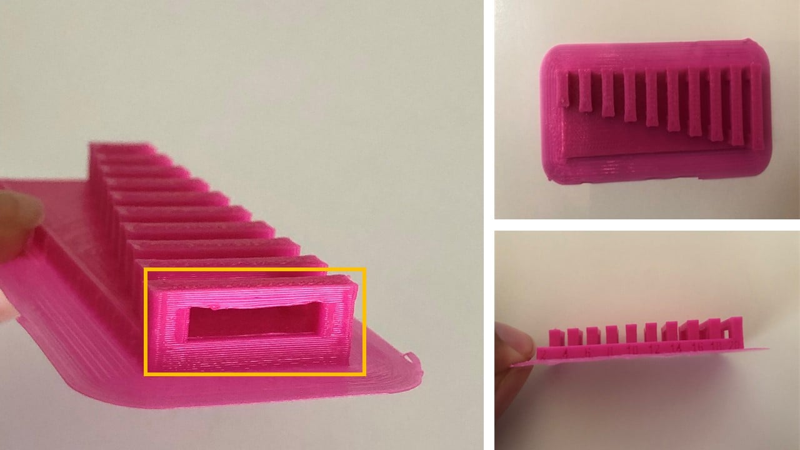
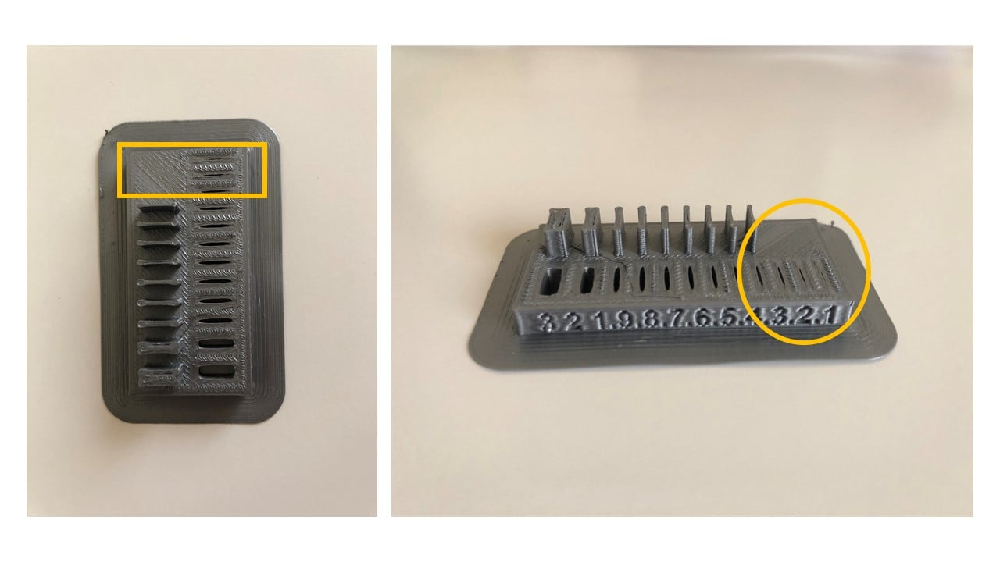

# 6. 3D Scanning and printing

<<<<<<< HEAD

=======
## ** Bridging and Wall Thickness Test (Amal Ashoor)**

I chose two design rules, wall thickness, and bridging, to define the limitations of the Ultimaker 3D printer. In the beginning, I downloaded the design rules from FabAcademy website as (.stl) files. For bridging, I opened the bridging (.stl) file in Ultimaker Cura software. I used the icons on the left sidebar to move, rotate and scale the object.

Then, I pressed on "Prepare" to adjust the printing settings. Firstly, I set the layer length to 0.2 mm. Secondly, I selected the infill pattern to be triangles with 20% density. Thirdly, I adjusted the printing speed to 70 mm/s. Finally, I enabled a prime blob.

Then, I clicked on slice and preview to know exactly how the layers will be build-up by the printer. After selecting the printing settings, I saved the file to disk in the format (.Gcode).

To start the printing process, I ensured that the desired material is connected to the printer. I selected the desired material as a pink PLA. Then, I clicked on confirm and chose the design file to start the printing process. After the completion of the printing process, I allowed the printer to cool down for a few minutes before I removed the design. I noticed that the 18 and 20 mm bridges were slightly curved outwards from the middle.

For wall thickness, I repeated the same process with gray PLA. As a result, I noticed that the 3D printer is unable to produce any wall or gap with a thickness less than 0.4 mm.

>>>>>>> 4255d2635aa16b1cb2a9e0e8819f10f8b977a776

## **  Angles and the Dimensions Test (Yousif Jalil)**

For this assignment, i think the goal is to find the optimum settings for what your printer can print through angles, overhangs, Bridges, Spaces, etc. For the assignment i have chosen to print the Angles and the Dimensions models.

 
 
 
 
 I know for a fact that ultimaker printers are very good compared to their chinese Competitors from my experience, also depending on the printer the more you fine tune the settings the better the results you will get, Knowing how ultimaker is a good printer, i only did two trials for each materials one try with 0.1mm layer height and the other is 0.2mm layer height.
 
 
 *** Angle Model ***
 
 The Gray one is 0.2mm and the Blue one is 0.1mm in layer height respectively, if you focus on the blue one can see that there aren't 3d printed lines showing clearly as the gray one this because of the layer height.

 

Here we can see the effects of the layer height in detail as the angle increases more artifacts start to appear and the print begins to lose quality, from the picture i can say that if i had a model with that has angles from more than 50 degrees it's better to go with 0.1mm layer height to decrease the chance of print fail

***Dimension Model ***

Here it's obvious that the left one is 0.2mm and the right 0.1mm due to simply that the numbers on 0.1mm is much clearer than 0.2mm

