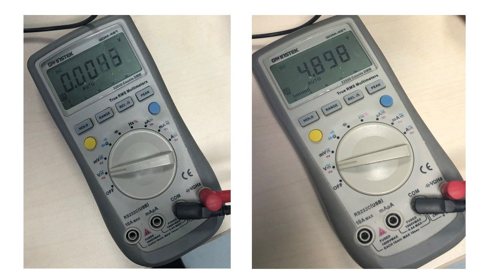

# 7. Electronics design

## Requirements:
1.  Redraw the attiny45 board with the following conditions:
- use different Microcontroller (for ex: attiny44 or atmega328)
- it should include at least one LED with current limiting resistor and one button
- extra credit: add different inputs and outputs

## Deadline: Sunday 10/1/2021

## Support Material

- Introduction to PCB Design with Eagle CAD (Recorded lecture by Fablab UAE)
<iframe width="560" height="315" src="https://www.youtube.com/embed/u_EjbBBpyro" frameborder="0" allow="accelerometer; autoplay; clipboard-write; encrypted-media; gyroscope; picture-in-picture" allowfullscreen></iframe>
- [Fablab Eagle Library](https://gitlab.fabcloud.org/pub/libraries/electronics)

- [attiny45 ttraffic light schematic](../files/w7/attiny45light.sch)
- [attiny45 ttraffic light Board](../files/w7/attiny45light.brd)

<<<<<<< HEAD

=======
## **Multimeter (Amal Ashoor)**

In this week group assignment,I used to measure the voltage of the board using the multimeter, by connecting the black and red ends to the board GND and the VCC, repectively. As you can see, the voltage is around 5V when the button is pressed. However, it become 0V when the button is released.

