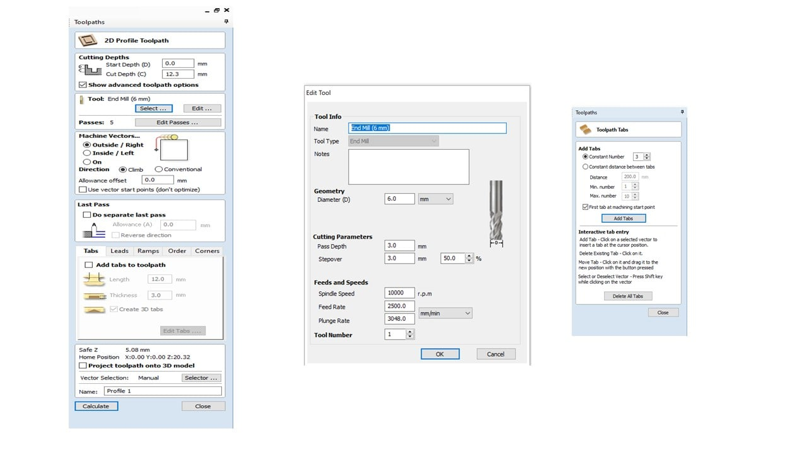

# 8. Computer controlled machining

## **Amal Ashoor**
I chose to examine the fitting feature for the ShopBot machine. I designed four pieces using Fusion 360, where three are female and a single male. The male piece has a 40 mm pocket while the females have 39.6, 39.8, and 40 mm. I set the following cutting settings in the VCarved software to cut 12 mm plywood.

The female with a 40 mm pocket fits the male piece perfectly, as shown below.

## **Yousif Jalil**
 For the group assignment I choose the slot to test the machine,
 so I sketched the slot and then cut it with the shopbot machine 
 As seen in the sketch one of the slots has width of 12mm while the other has width of 11.8mm this is to test the which is more tighter fit.
 
 
 
 

