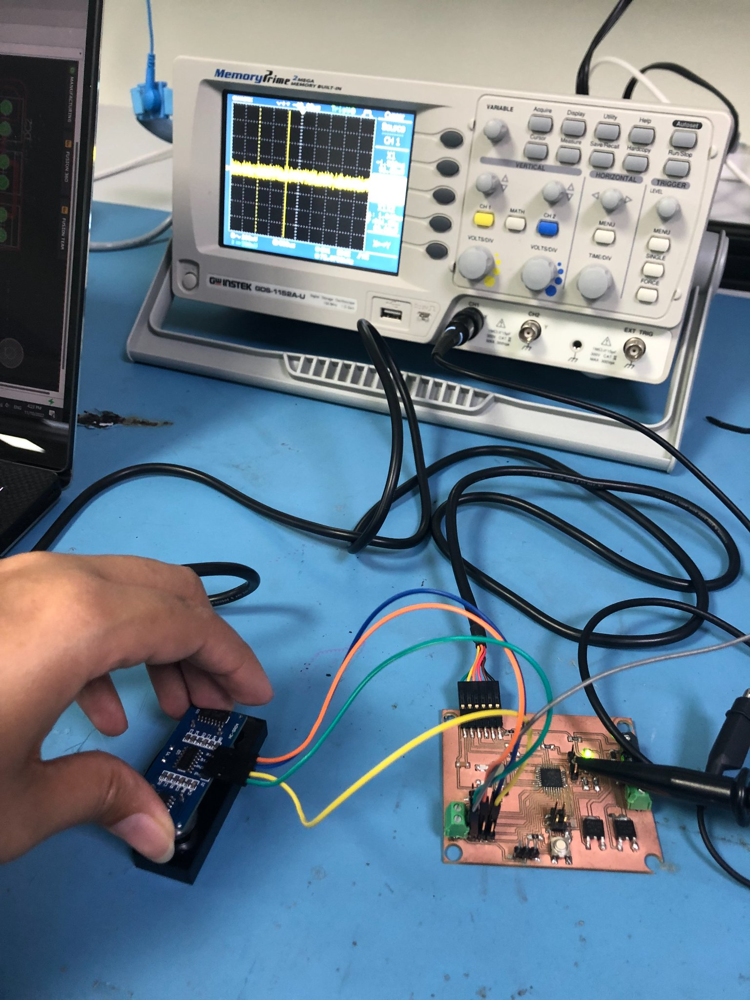
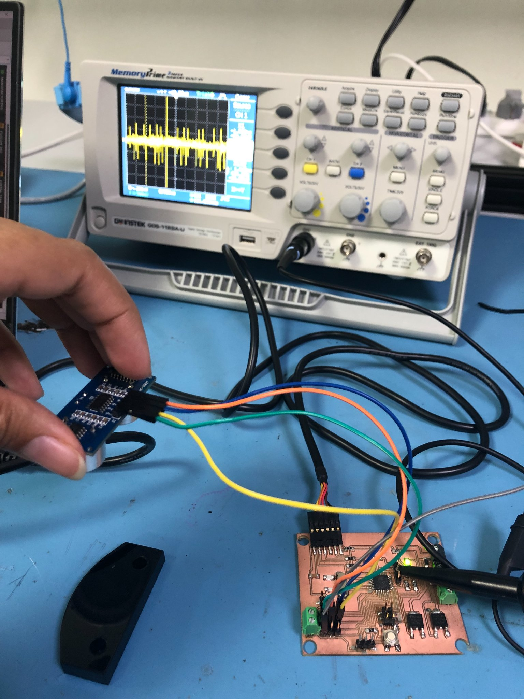

# 11. Input devices

## **Ultrasonic Distance Sensor (Amal Ashoor)**

In the input week, I connected Ultrasonic Distance Measuring sensor as an input device to my ATmega328 board. So, I wanted the observe the change in the voltage signal using an oscilloscope as the distance change. 

{width="50%"}

{width="50%"}

