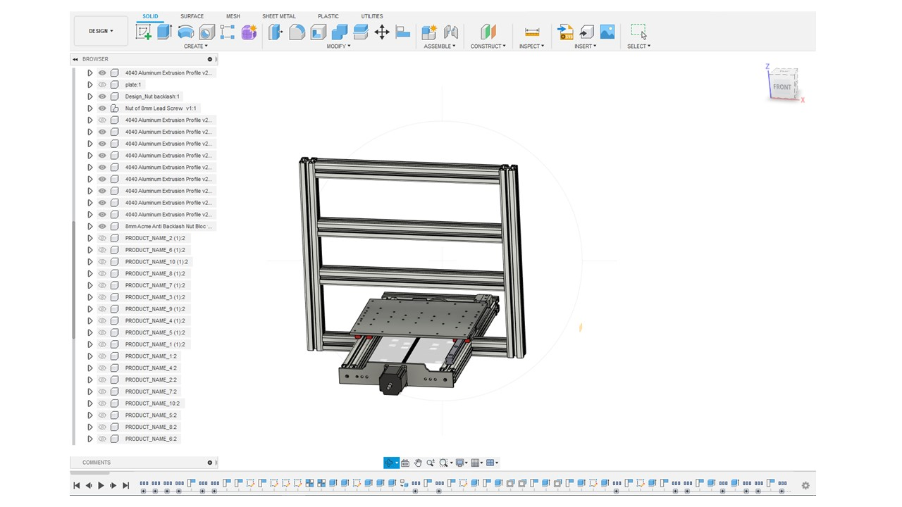
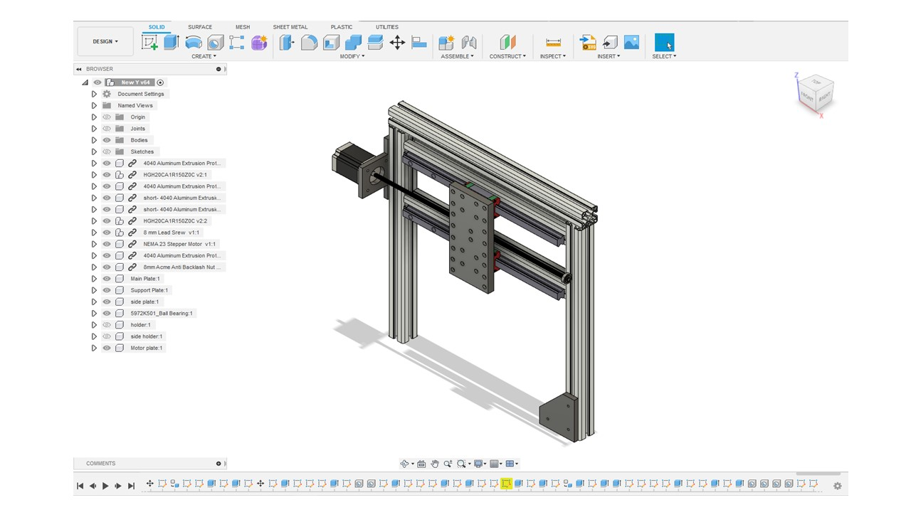
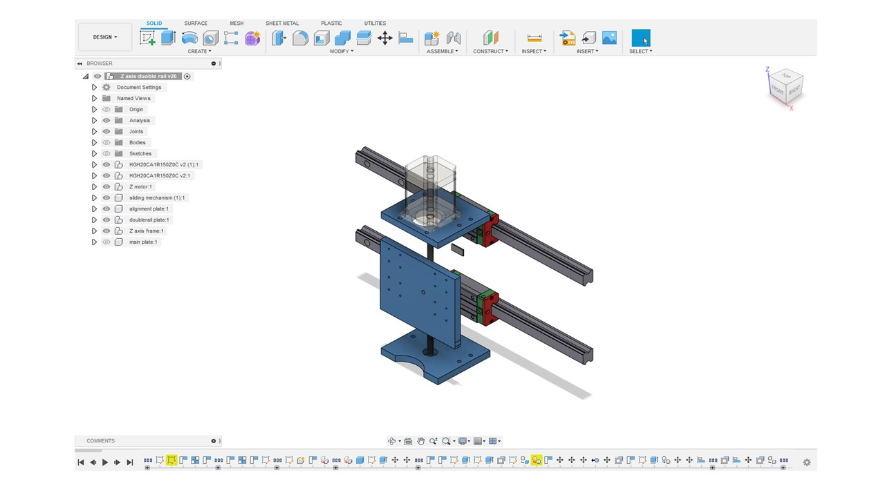

# 12. Mechanical design & Machine Building

### Group assignment:  

- Design a CNC machine with three-axis movement.
- Operate the machine manually.
- Automate the machine.

## Video

<iframe width="560" height="315" src="https://www.youtube.com/embed/Nu-Y4wbuB4I" title="YouTube video player" frameborder="0" allow="accelerometer; autoplay; clipboard-write; encrypted-media; gyroscope; picture-in-picture" allowfullscreen></iframe>

## The Idea

This week my colleagues and I decided to design a CNC milling machine. This machine has a three-axis movement. We started by discussing the required components to construct the machine. Then, we divide the tasks based on the axis.

**Defining the Project:** To design & build a CNC Milling Machine

**The project will consist of four main pillars:**

- **Design**
- **Production and Assembly**
- **Testing**

## Design
In this part, we started by collecting the fusion 360 designs of the main components of the machine from GRABCAD library. These components are stepper motor NEMA 23, 4040 Aluminum extrusion profile, 8 mm lead screw, ball bearing, 8 mm acme anti-backlash nut, and linear bearings slides and rails.

### X- Axis
Yousef Mohammad Jalil in charge of the X-Axis design.

The design parts of the X axis include three Aluminum extrusion profiles and designed Aluminum plate to hold the NEMA 23 stepper motor. Two of the three extrusion profiles are 475 mm, where the linear bearings and rails are placed. The stepper motor is connected to an 8 mm lead screw that passes into an anti-backlash nut. This lead screw interface is placed under the main bed used for the milling purpose and move the bed to the north and south.

X-axis design in Fusion360

### Y- Axis
Amal Ashoor in charge of the Y-Axis design.

Y-Axis consists of five Aluminum extrusion profiles, three with 500 mm length and the others with 470 mm. The long profiles are connected in a way to form an open square. The shape will enable the connection between the x-axis and the y-axis. On the other hand, the short profiles are placed in a parallel way at a calculated height from the X-axis design, and contains the linear bearings and rails. In the middle of the spacing area between the short profiles, the stepper motor interface and an Aluminum plate. This axis will move the Aluminum plate to the east and west.

Y-Axis design in Fusion360

### Z- Axis
Ali Alharthi was in charge of the Z-Axis design.

For the z-axis design, two 2040 Aluminum extrusion profiles that contains two bearing per rail each and a designed Dremel 300 spindle plate are required. Behind this plate is a anti-backlash nut that is connecte to an 8 mm lead screw and a NEMA23 stepper motor that placed on top of the y-axis Aluminum plate. This design will move the spindle up and down.

### Electronics Design
The used electronics components are:
- Three NEMA23 Stepper Motors
- Three Stepper Motor Drivers
- An Arduino Uno Board
- A CNC Shield
- 12V Power Supply
- A Dremel 300 Spindle

Our project consists of three NEMA 23 stepper motors. Each motor is connected to an axis and move the parts using the Stepper Motor Drivers. Then, all of the stepper drivers are connected to an CNC Shield, where it is placed above an Arduino Uno Board. The motors are operated using a power supply and the spindle is connected to  electricity. Arduino was used to control the speed and direction of rotation of the motors. The spindle speed was controlled from its power supply.

## Production and Assembly

### For X-Axis:

We used the ShopBot CNC machine to create the bed base and the stepper motor holder. The used bed here was cutted using Universal Laser Cutter. All the parts were assembled by screws with diameters 5mm and 6mm.

### For Y-Axis:
We used the ShopBot machine to create y-axis main plate. Also, we used a laser cutter to create the motor plate in the y-axis. In the assembly part, we used the x-axis frame to place the y-axis parts.

### For Z-axis
We used the ShopBot machine to create the spindle plate. Then,we used a laser cutter to create the top and bottom plates to place the motor from acrylic.
To assemble this part, we attached the top plate to the y-axis and place the motor on it. Then, we connect the motor with the lead screw.

## Design Files
[X-axis design in STL File](../files/CNC_Assembly.stl)
[Y-axis design in STL File](../files/CNC_Assembly.stl)
[Z-axis design in STL File](../files/CNC_Assembly.stl)
